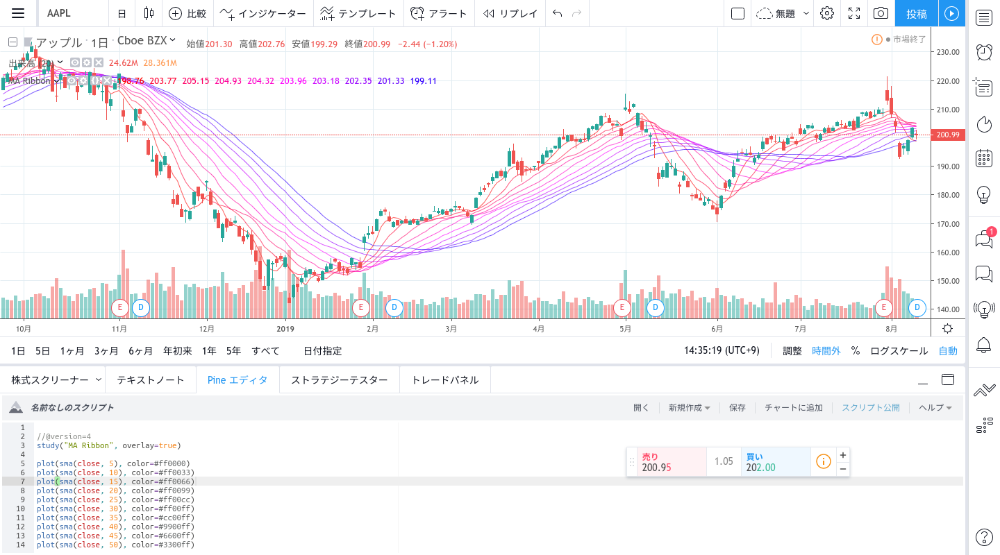
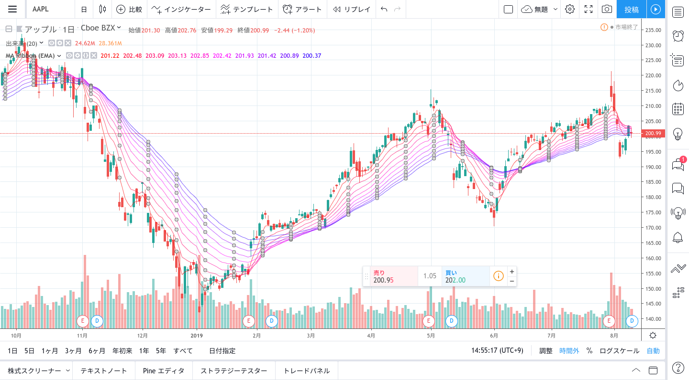
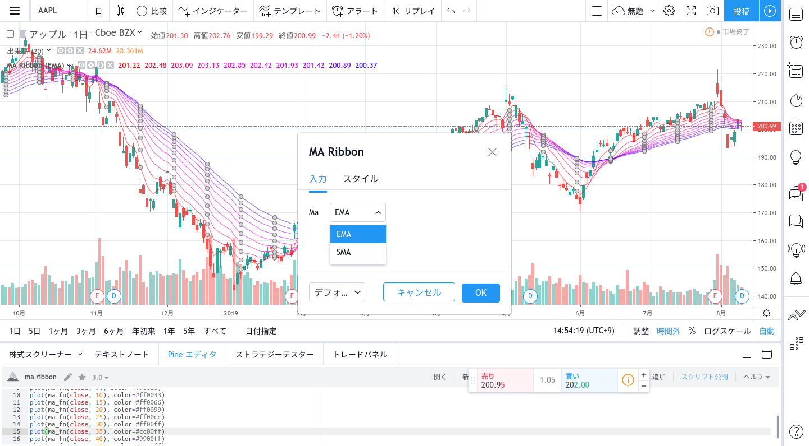

引き続き、MA Ribbon に機能を追加して、より使いやすいインジケータを作成してみたいと思います。

<!-- toc -->

## 色を追加する

色を変更するためには`plot`の`color`を使います。

```js
//@version=4
study("MA Ribbon", overlay=true)

plot(sma(close, 5), color=#ff0000)
plot(sma(close, 10), color=#ff0033)
plot(sma(close, 15), color=#ff0066)
plot(sma(close, 20), color=#ff0099)
plot(sma(close, 25), color=#ff00cc)
plot(sma(close, 30), color=#ff00ff)
plot(sma(close, 35), color=#cc00ff)
plot(sma(close, 40), color=#9900ff)
plot(sma(close, 45), color=#6600ff)
plot(sma(close, 50), color=#3300ff)
```



きれいなグラフになってきました。

## 平均の計算方法を変更する

[この記事](https://www.investopedia.com/terms/g/guppy-multiple-moving-average.asp)によると、

> The responsiveness of the indicator can be adjusted by changing the number of time periods used in the moving averages, or by changing the type of moving average from a simple moving average (SMA) to an exponential moving average (EMA).  
> 移動平均を求める期間を変更する、もしくは平滑化関数を SMA から EMA に変更することでインジケータの応答性を調整できます。

ということなので、早速[EMA](https://www.moneypartners.co.jp/support/tech/ema.html)と SMA とで切り替えられる仕組みを作りたいと思います。

使う関数は[`input`](https://jp.tradingview.com/pine-script-reference/#fun_input)関数です。

```js
//@version=4
study("MA Ribbon", overlay=true)

ma_type = input(title="ma", defval="SMA", options=["SMA","EMA"])

ma_fn(src, period) =>
  ma_type == "SMA" ? sma(src, period) : ema(src, period)

plot(ma_fn(close, 5), color=#ff0000)
plot(ma_fn(close, 10), color=#ff0033)
plot(ma_fn(close, 15), color=#ff0066)
plot(ma_fn(close, 20), color=#ff0099)
plot(ma_fn(close, 25), color=#ff00cc)
plot(ma_fn(close, 30), color=#ff00ff)
plot(ma_fn(close, 35), color=#cc00ff)
plot(ma_fn(close, 40), color=#9900ff)
plot(ma_fn(close, 45), color=#6600ff)
plot(ma_fn(close, 50), color=#3300ff)
```



`input`関数を用いることで、平滑化関数の切り替えも設定画面から簡単にできるようになります。



### まとめ

1. `input`の中身はわかりやすく

1. 平滑化関数を定義してそれを利用する

import { Message } from "rbx";

<Message color="info">
  <Message.Body>
    pine スクリプトでは関数は第 1 級オブジェクトではないので、関数を定義する使い方はできません。<br />
    例:

    ma_fn := ma_type == "SMA" ? sma : ema

  </Message.Body>
</Message>
