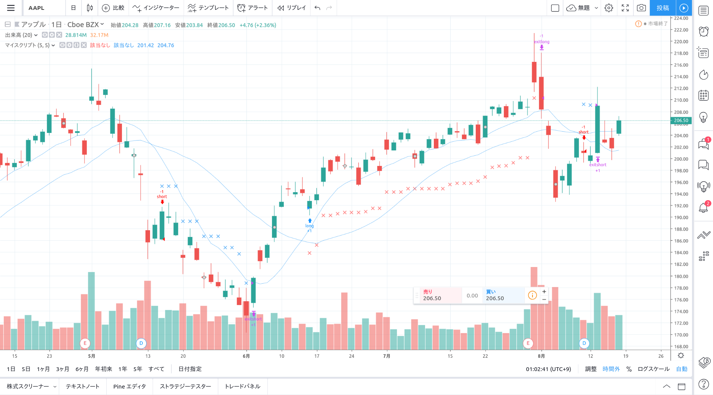

今回は、トレイリングストップを pine スクリプトで計算する方法について解説します。

## トレイリングストップとは

[この](https://kabu.com/item/auto_trading/trailingstop/default.html)サイトによると、トレイリングストップとは次のような注文です。

> 高値安値に合わせて、逆指値注文をリアルタイムに自動修正する自動売買です。同じ売るなら少しでも高いところで売りたい、高値から下落してきたところで売りたい、という場合等で活用できます。
> 売りの場合であれば、「株価の上昇にあわせて、高値から ○ 円の逆指値を切り上げ、株価の値上がりに追従しつつ、反落し始めたところで売り発注」ということが可能です。
> 買いの場合は、「少しでも安いところで買いたいが、安値から ○ 円上がって来たら買い発注」ということが可能です。

## TradingView でトレイリングストップを行う方法

では実際にトレイリングストップの注文を行うスクリプトを、Trading View で作成していきたいと思います。トレイリングストップ注文は、次の 3 つの部品から構成されます。

1. トレイリングストップのストップ値を入力する
1. 各レンジ毎に計算してプロットする
1. 注文を行う

その内容を具体的に見ていきたいと思います。

### トレイリングストップのストップ値を入力する

`input`関数を利用して、トレイリングストップのストップ幅（％値）を外部から入力できるようにします。今回は、ストップ幅をパーセントで設定でき、かつ、ロングとショートと別々にストップ幅を設定できる構成としています。

```pine
//@version=4
strategy("マイスクリプト", (overlay = true))

stop_long = input(5.0, title="stop long%", type=input.float, minval=0, step=0.2)
stop_short = input(5.0, title="stop short%", type=input.float, minval=0, step=0.2)
```

ストップロスの計算を行うために、実際にポジションを取っているかを判断基準として利用するため、`strategy`を利用します。

### 各レンジ毎に計算してプロットする

では実際に値を計算する関数を作成していきたいと思います。今回は再利用しやすいように、関数部分を別途切り出して作成していきます。

```pine
// ポジションを取っているか否かを判定する ★②
have_position(position) =>
    position == strategy.long ? (strategy.position_size > 0) : (strategy.position_size < 0)

// トレイリングストップ戦略で、価格を更新すべきか否かを判断する ★②
should_update_price(position, value) =>
    na(value) or ((position == strategy.long) ? (value < high) : (value > low))

trailing_stop_price(position, percent) => //★②
    float value = na // ★①
    if (have_position(position))
        if (should_update_price(position, value[1]))
            // 価格を更新するときは、高値 or 安値を変更する
            value := (position == strategy.long) ? high : low
        else
            // 価格を変更しない場合は前回の値を代入する
            value := value[1]
    // すべての値を％で掛け算して結果を返す
    value * percent

long_stop_price = trailing_stop_price(strategy.long, (100 - stop_long) / 100)
short_stop_price = trailing_stop_price(strategy.short, (100 + stop_short) / 100)

plotshape(long_stop_price, style=shape.xcross, color=color.red, location=location.absolute, size=size.tiny) // ★③
plotshape(short_stop_price, style=shape.xcross, color=color.blue, location=location.absolute, size=size.tiny)
```

ポイントは以下です。

- **プロットしない時は na を代入する** (★①)  
  ポジションを取っていないときは、na を値に代入することによりストップ値をプロットさせないようにします

- **共通部を関数として切り出す** (★②)  
  共通部として切り出し再利用性を高めています。（切り出し方は上手くないですが…）

- プロットする際は location.absolute を設定する (★③)  
  これによって、図形の表示される位置を、チャートの値に揃えることができるようになります。

import { Message } from "rbx";

<Message color="warning">
  <Message.Header>Important</Message.Header>
  <Message.Body>
    highest関数は、トレイリングストップ値を計算するのには利用できません。
    <br />
    ポジションを取る期間が長くなった場合に、正しく計算できない恐れが有ります。
  </Message.Body>
</Message>

### 注文を行う

最後に、エントリーした後にポジションをトレイリングストップを利用してクローズします。

新規にポジションを立てる場合は`strategy.entry`関数を利用します。ポジションを決済する場合は`strategy.exit`関数を利用します。

また、念の為ポジションを持っていない場合を考慮して（ドテン等で exit が実行されなかった場合）、`strategy.cancel`関数を利用して決済の注文をキャンセルしています。（これを怠ると、次回ポジションを立てたと同時に決裁されてしまう可能性があるため）

```pine
if (long_entry)
    strategy.entry('long', strategy.long)
    strategy.exit('exitlong', 'long',stop=long_stop_price)

if (have_position(strategy.long))
    strategy.exit('exitlong', 'long', stop=long_stop_price)
else
    strategy.cancel('exitlong')

if (short_entry)
    strategy.entry('short', strategy.short)
    strategy.exit('exitshort', 'short', stop=short_stop_price )

if (have_position(strategy.short))
    strategy.exit('exitshort', 'short', stop=short_stop_price)
else
    strategy.cancel('exitshort')
```

以上でトレイリングストップのスクリプトができました。

## スクリプト全体

最後に、スクリプトの全体を再度掲載します。今回はエントリーポイントとして、10SMA と 25SMA のゴールデンクロスでエントリーするスクリプトを例に作成しました。

```pine
//@version=4
strategy("マイスクリプト", overlay=true)

stop_long = input(5.0, title="stop long%", type=input.float, minval=0, step=0.2)
stop_short = input(5.0, title="stop short%", type=input.float, minval=0, step=0.2)

have_position(position) =>
    position == strategy.long ? (strategy.position_size > 0) : (strategy.position_size < 0)

should_update_price(position, value) =>
    na(value) or ((position == strategy.long) ? (value < high) : (value > low))

trailing_stop_price(position, percent) =>
    float value = na // ★①
    if (have_position(position))
        if (should_update_price(position, value[1]))
            value := (position == strategy.long) ? high : low
        else
            value := value[1]
    value * percent

long_stop_price = trailing_stop_price(strategy.long, (100 - stop_long) / 100)
short_stop_price = trailing_stop_price(strategy.short, (100 + stop_short) / 100)

plotshape(long_stop_price, style=shape.xcross, color=color.red, location=location.absolute, size=size.tiny)
plotshape(short_stop_price, style=shape.xcross, color=color.blue, location=location.absolute, size=size.tiny)

sma_short = sma(close, 10)
sma_long  = sma(close, 25)

long_entry = crossover(sma_short, sma_long)
short_entry = crossunder(sma_short, sma_long)

if (long_entry)
    strategy.entry('long', strategy.long)
    strategy.exit('exitlong', 'long',stop=long_stop_price)

if (have_position(strategy.long))
    strategy.exit('exitlong', 'long', stop=long_stop_price)
else
    strategy.cancel('exitlong')

if (short_entry)
    strategy.entry('short', strategy.short)
    strategy.exit('exitshort', 'short', stop=short_stop_price )

if (have_position(strategy.short))
    strategy.exit('exitshort', 'short', stop=short_stop_price)
else
    strategy.cancel('exitshort')

plot(sma_short)
plot(sma_long)
```

## 実行結果



高値が更新されるに連れて赤い × で示すストップの値が徐々に上昇し、その値を割り込んだときに決済が完了しました。

## まとめ

- トレイリングストップを計算する場合は、ポジションを取っている期間内での、最高値（ないしは最安値）を計算する
- bar 毎に計算した最高値（ないしは最安値）を利用してストップ価格を更新する

happy trading life!
