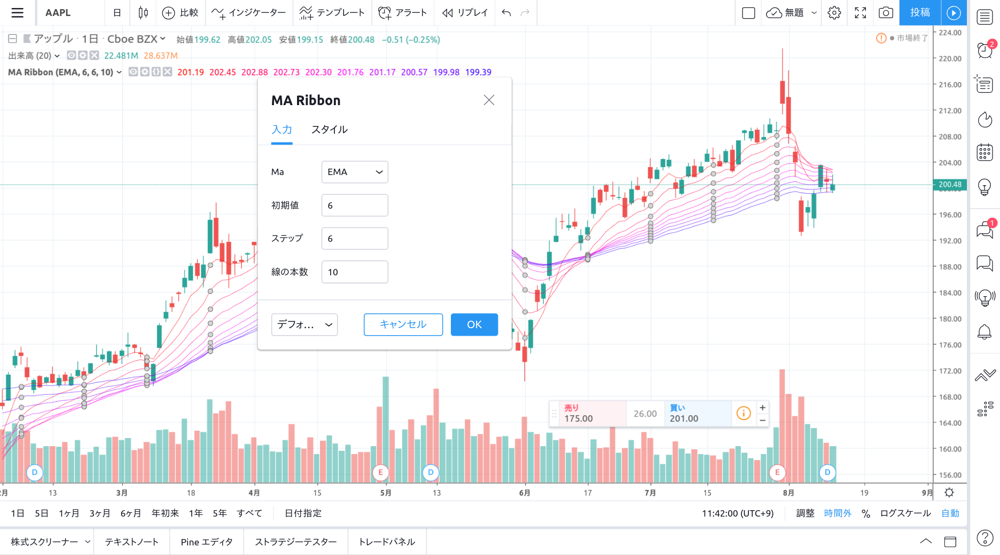
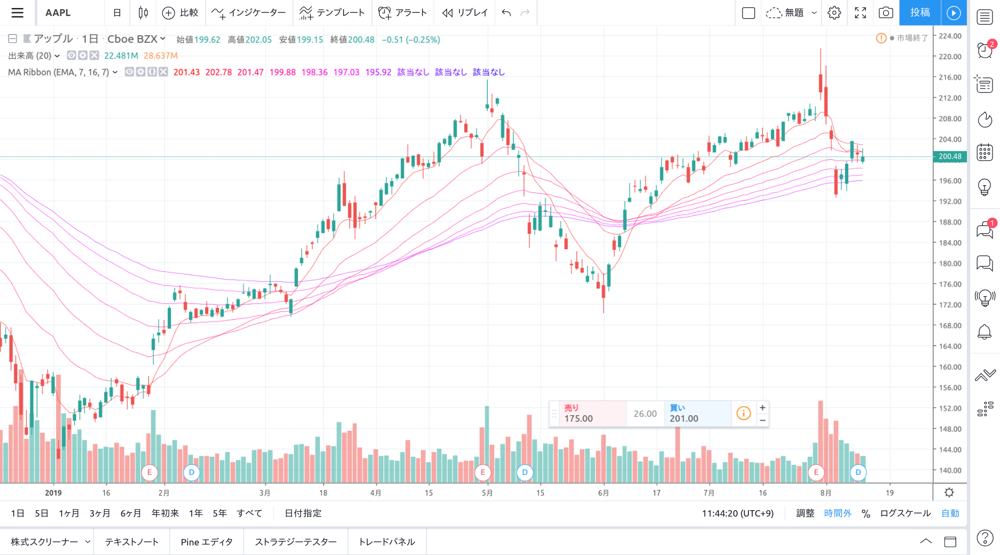

前回までに、input の基本的な使い方を学習しました。この記事では input を更に使いこなして、カンタンにカスタマイズできる MA Ribbon チャートを作成したいと思います。

## input 関数とは

公式リファレンスから引用すると、

> スクリプトインジケーターに入力を追加。ユーザーはスクリプトスタディのオブジェクトダイアログのフォーマットに入力することで、表示や編集を行うことができます。入力されたスクリプトはビルトインされたテクニカル分析インジケーターと同様にしっかりと表示され稼働します。

…？

input 関数とは、input 関数で定義した値が UI 上で簡単に変更でき、スクリプトを変更しなくてもパラメータを変更したインジケータを作成して表示させることができる機能になります。

すでに 1 度使っていますが、例えば以下のような記述です。

```cpp
ma_type = input(title="ma", defval="SMA", options=["SMA","EMA"])
```

この記述により、変数`ma_type`には、UI 上で設定した文字列(SMA/EMA)が設定され、それ以降のスクリプト内で値を利用することが可能になります。

選択肢を出す以外でも、「文字列を自由に入力する」「数値を代入する」「元になるインジケータを選択する」といったことが可能です。

input 関数の詳細は別途、ここにまとめてあります。

## input 関数を利用して MA Ribbon の各種パラメータを変更する

今回は、MA Ribbon のうち「初期値」「ステップ値」「ステップ数」を可変にしてみようと思います。

以下スクリプト例です。（エディタ欄にコピー＆ペーストしてください）

```cpp
//@version=4
study("MA Ribbon", overlay=true)

ma_type = input(title="ma", defval="SMA", options=["SMA","EMA"])

ma_fn(src, period) =>
  ma_type == "SMA" ? sma(src, period) : ema(src, period)

init = input(5, title="初期値", minval=5)
step = input(5, title="ステップ", minval=1)
count = input(10, title="線の本数", maxval=10)

plot(ma_fn(count > 0 ? close : na, init + step * 0), color=#ff0000)
plot(ma_fn(count > 1 ? close : na, init + step * 1), color=#ff0033)
plot(ma_fn(count > 2 ? close : na, init + step * 2), color=#ff0066)
plot(ma_fn(count > 3 ? close : na, init + step * 3), color=#ff0099)
plot(ma_fn(count > 4 ? close : na, init + step * 4), color=#ff00cc)
plot(ma_fn(count > 5 ? close : na, init + step * 5), color=#ff00ff)
plot(ma_fn(count > 6 ? close : na, init + step * 6), color=#cc00ff)
plot(ma_fn(count > 7 ? close : na, init + step * 7), color=#9900ff)
plot(ma_fn(count > 8 ? close : na, init + step * 8), color=#6600ff)
plot(ma_fn(count > 9 ? close : na, init + step * 9), color=#3300ff)
```

パラメータ編集画面を開くと、次のように設定項目が 4 つ（＝ input 関数の個数）になっていることがわかります。



適当にパラメータを変更して OK ボタンを押すと、パラメータで指定された形式に表示が切り替わりチャート上に MA Ribbon が表示されました。



<!--  import Chart from "../../../components/Chart.tsx";

 <Chart
 symbol="NASDAQ:AAPL"
 widgetType="chart"
 chart="mH5of7i1"
 locale="jp"
 autosize
 mobileStatic
 /> -->

import { Message } from "rbx";

<Message color="warning">
  <Message.Header>Important</Message.Header>
  <Message.Body>
if文でplot関数の有無を変更することはできません。<br />
すべての値が`na`になるように記載することにより、所定の条件でインジケータを表示させなくすることができます。

```cpp
// countの値が9以下の場合はインジケータを表示しない
plot(ma_fn(count > 9 ? close : na, init + step * 9), color=#000000)
```

  </Message.Body>
</Message>
