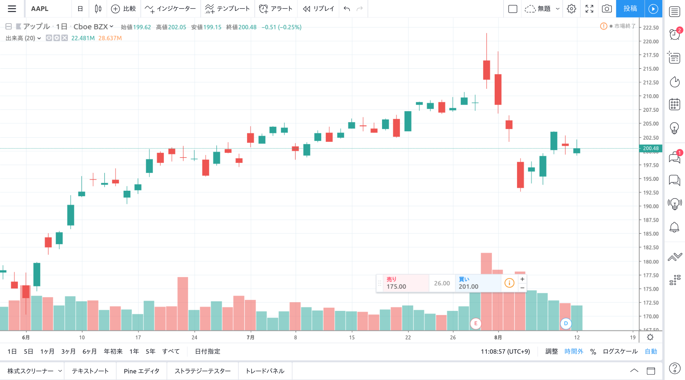

Pine スクリプトの Helloworld として移動平均線を表示する pine スクリプトを作成したいと思います。

## チャートを表示する

[この](https://jp.tradingview.com/chart/)リンクを開いてチャートを表示します。



## pine スクリプトを入力する

次の Pine スクリプトをコピーしてエディタ上に貼り付け、`チャートに追加`ボタンを押します

```cpp
//@version=4
study("moving average")

plot(sma(close, 5))
```

すると次のような画面が表示されインジケータが出力されます。


このままだと、価格のロウソクバーと移動平均とが違う画面にプロットされてしまい、非常に見にくいです。

なので、同じ画面にプロットされるように記述を一部変更したいと思います。

```cpp
//@version=4
study("moving average", overlay=true)

plot(sma(close, 5))
```

study 関数の引数`overlay`に`true`を入れると、デフォルトでロウソクバーと同じ画面内に各種プロットが表示されます。

study 関数の詳細は[この](../references/study)ページを参考にしてください。


## MA Ribbon の作成

次に、MA Ribbon と呼ばれるインジケータを作成してみます。

MA Ribbon とは、

> Moving average ribbons are a series of moving averages (MA) of different lengths that are plotted on the same chart to create a ribbon-like indicator.  
> 長さの異なる移動平均線を複数、チャートと同じ画面に配置したインジケータ

とのことです。移動平均リボンについては[こちら](https://www.investopedia.com/terms/m/movingaverageribbon.asp) のサイトをご参考ください。（英語ですがいずれ日本語化できれば…）


```cpp
//@version=4
study("MA Ribbon", overlay=true)

plot(sma(close, 5))
plot(sma(close, 10))
plot(sma(close, 15))
plot(sma(close, 20))
plot(sma(close, 25))
plot(sma(close, 30))
plot(sma(close, 35))
plot(sma(close, 40))
plot(sma(close, 45))
plot(sma(close, 50))
```
