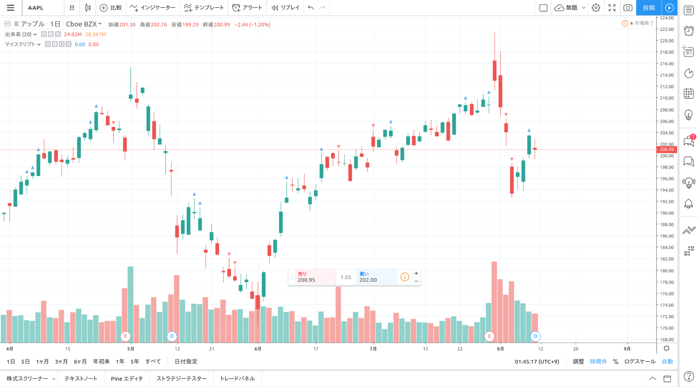

pine スクリプトの便利関数として、all、any を作りたいと思います。 (なぜ標準機能に無いのかが分からないようなものですが…)

## all, any とは

all 関数、any 関数とは主に配列に対して適用する関数です。all 関数は、与えられた配列のすべての要素が条件を満たしている場合は`true`を返します。一方 any 関数は、与えられた配列のいずれか 1 つの要素が条件を満たしている場合に`true`を返します。
javascript では`Array.every`, `Array.some`関数、python では(少し違いますが)`all()`,`any()`関数等、近年の関数型言語の流れを持つプログラミング言語には実装されていることが多い概念です。

これら`all`, `any`関数は、例えば「3 日以上移動平均線よりも終値が高い場合にインジケータを表示したい」等、特定の期間との判断に頻繁に利用する関数だと思います。

## 実装

以下の実装を、利用したい pine スクリプト内にコピーしてください。

```cpp
all(conds, len) =>
    b = true
    for i = 0 to len - 1
        b := b and conds[i]
    b

any(conds, len) =>
    b = false
    for i = 0 to len - 1
        b := b or conds[i]
    b
```

## 使い方

今回は題材として、TradingView に内蔵されている「Consecutive Up/Down Strategy（連続アップ/ダウンストラテジー）」をこの all 関数を利用して実装してみたいと思います。

```cpp
//@version=4
study("マイスクリプト", overlay=true)


all(conds, len) =>
    b = true
    for i = 0 to len - 1
        b := b and conds[i]
    b

any(conds, len) =>
    b = false
    for i = 0 to len - 1
        b := b or conds[i]
    b

long = open < close
short = open > close

plotshape(all(long, 3), style=shape.triangleup)
plotshape(all(short, 3), style=shape.triangledown, color=color.red)
```



all 関数を利用することで、簡潔にわかりやすく実装することができました。
