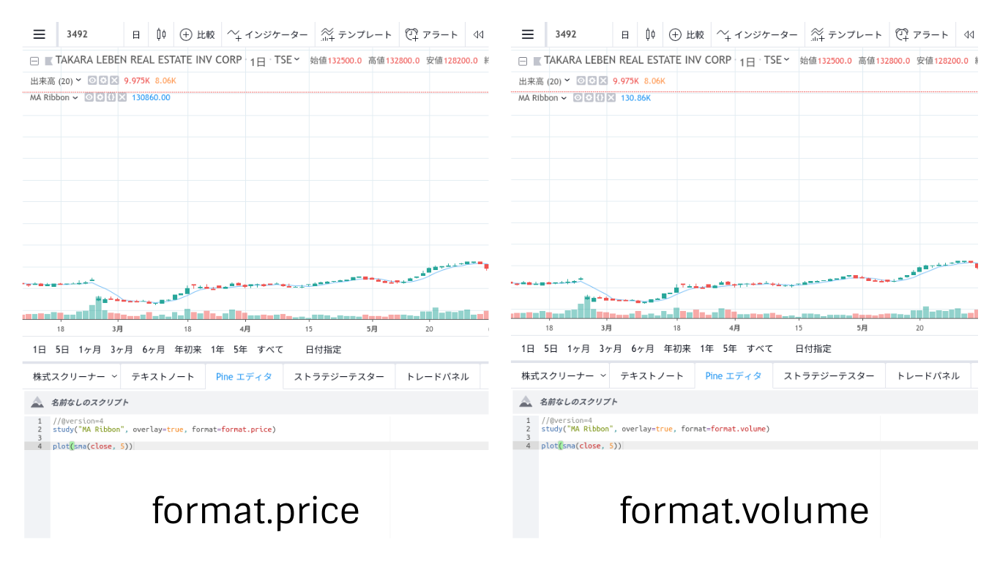

## Study コマンド

```
study(title, shorttitle, overlay, format, precision, scale, max_bars_back) → void
```

### 引数

#### format(const string)

- format.price  
  カーソルを当てた箇所の値が数値で表示される

- format.volume  
  カーソルを当てた箇所の値が省略した数値で表示される (10.5K, 123M 等)


