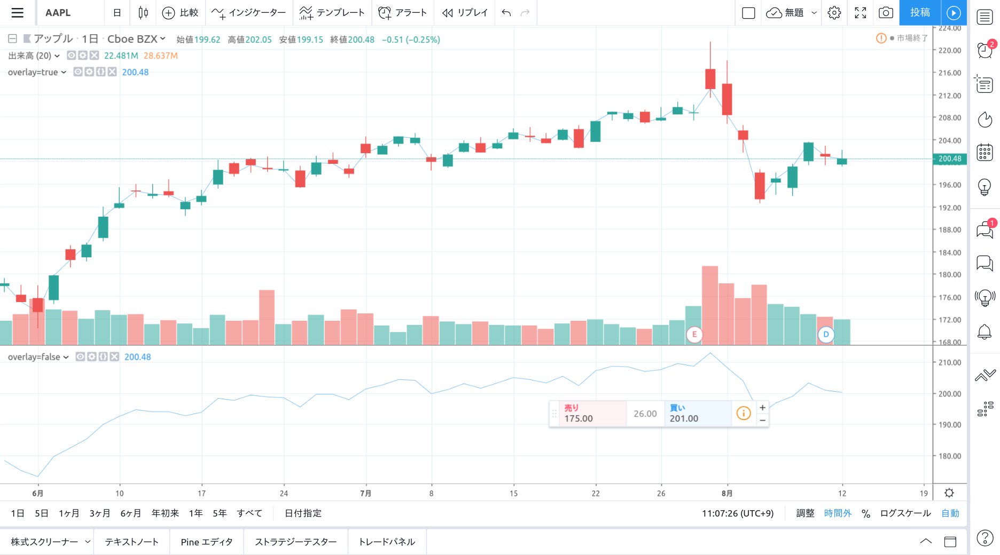
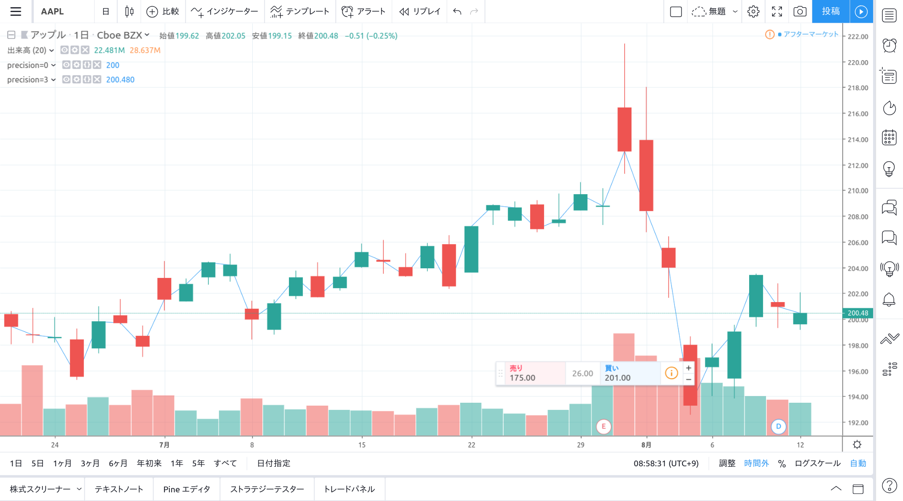
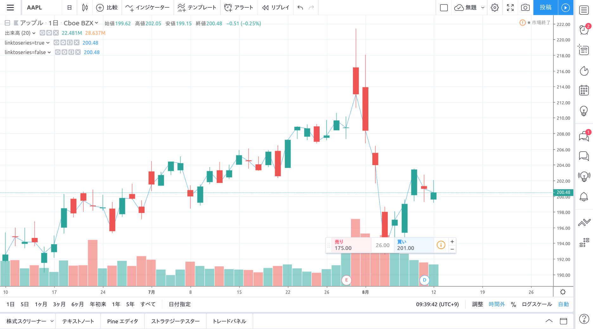

## Study コマンド

```
study(title, shorttitle, overlay, format, precision, scale, max_bars_back) → void
```

[公式リファレンス](https://jp.tradingview.com/pine-script-reference/v4/#fun_study)

### 引数

#### format(const string)

- format.price  
  カーソルを当てた箇所の値が数値で表示される

- format.volume  
  カーソルを当てた箇所の値が省略した数値で表示される (10.5K, 123M 等)


#### overlay (const bool)

インジケータをチャートと同じ画面に表示するか、別の画面に表示するか



#### precision (const integer)

インジケータの数値を表示する際の桁数。

> 16 以下の正の整数である必要があります。



#### scale (const integer)

> インジケータを添付するべき価格スケール。

- scale.left  
  左側の軸にスケールが表示され、それに沿ってプロットされる

- scale.right  
  右側の軸にスケールが表示され、それに沿ってプロットされる

- scale.none  
  ???

- 設定なし  
  ロウソクバーと同じ軸に沿ってプロットされる

#### linktoseries (const bool)

> もし true の場合、研究は常に主な形式として同じペイン及び同じ価格スケールになります。

true と false との差分が見当たりません。どちらでも問題ないと思われます。


